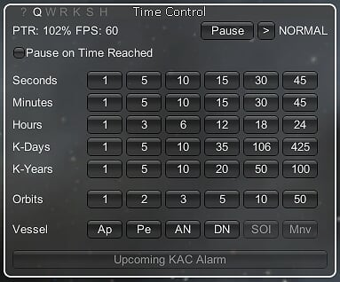
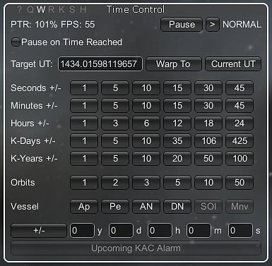
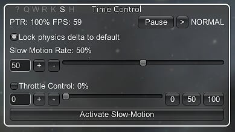
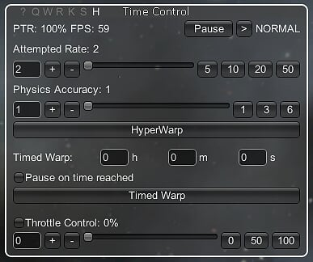
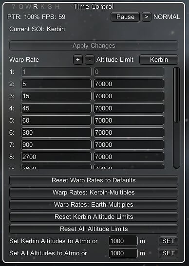
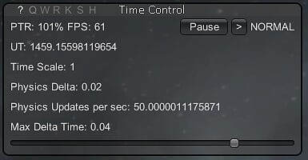
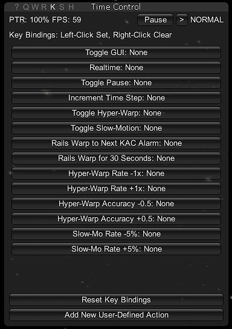
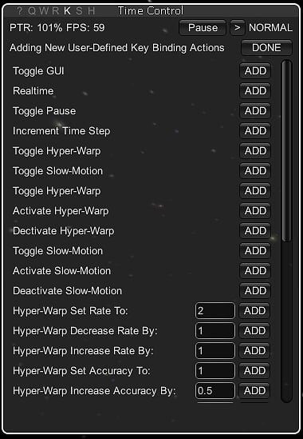
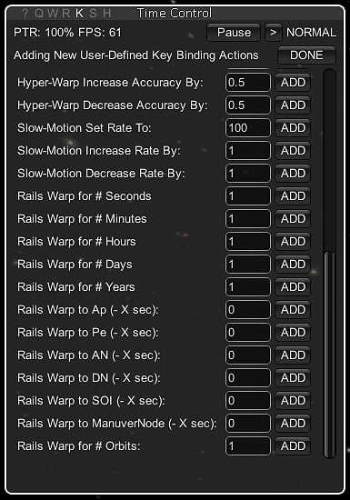
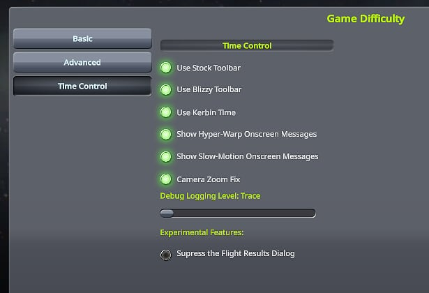

# Time Control /L Unofficial

Designed as an advanced successor to the popular Dynamic Warp mod, this mod allows you to slow down time, boost the rate of time without loss of precision, set custom warp rates and per-planet custom altitude limits, utilize automatic warping, and monitor performance.

Unofficial fork by Lisias.

## In a Hurry

* [Latest Release](https://github.com/net-lisias-kspu/TimeControl/releases)
	+ [Binaries](https://github.com/net-lisias-kspu/TimeControl/tree/Archive)
* [Source](https://github.com/net-lisias-kspu/TimeControl)
* Documentation
	+ [Project's README](https://github.com/net-lisias-kspu/TimeControl/blob/master/README.md)
	+ [Install Instructions](https://github.com/net-lisias-kspu/TimeControl/blob/master/INSTALL.md)
	+ [Tech Docs](https://github.com/net-lisias-kspu/TimeControl/blob/master/Docs/index.md)
	+ [Change Log](./CHANGE_LOG.md)
	+ [TODO](./TODO.md) list

## Description

Designed as an advanced successor to the popular Dynamic Warp mod, this mod gives you complete control of time in KSP by allowing you to slow down time to get those cool explosions on video(or find out why your rocket is blowing up on the pad), boost the rate of time to ridiculous levels without loss of precision to ease those long burns, set custom warp rates and per-planet custom altitude limits, utilize automatic warping, and monitor the physics engine and game performance.

### Usage:

The seven letters at the top of the window allow you to switch operation modes between details, quick warp, warp-to, rails editor, keybindings, slow-mo, and hyper warp. In the Space Center and Tracking Station, hyper warp and slow-mo are not available.

Pictures of the GUI are in each spoiler below.

#### _Q_uickWarp

Immediate rails warp for X number of seconds, minutes, hours, days, years, orbits, or specific vessel orbit locations.

#### _W_arp-To UT

Press "Current UT" to set the Target UT to the current game time. Press _Ap_ / _Pe_ / _AN_ / _DN_ / _SOI_ / _Mnv_ to set the Target UT to the time at that point in the current vessel's orbit.

**Left Click** on a number to **add** that amount of time to the Target UT.

**Right Click** on a number to **subtract** that amount of time from the Target UT.

You can also specify an exact amount and use the +/- button on the bottom to add or subtract that amount from the Target UT.

#### Slow-motion:

The slow motion menu gives you the ability to slow down time, or completely pause time and step forward frame by frame. By default, the slider slows down both the game speed and the physics delta, resulting in a smooth slow motion. Note that this will change how the physics of your vessel behaves, joints will stiffen and become more rigid (the opposite of what happens in phys-warp). This can sometimes cause problems with launch clamps or clipped parts, so beware. If you flip on the "lock physics delta" option, time will slow down, but the physics calculations won't change, so parts will appear to stutter and motion will be choppy. This allows you to see how your ship behaves at a much slower pace, so you can determine what might be going wrong. It is also very useful because even with high part counts where your computer is struggling with physics calculations, your frame-rate will NOT be slowed, so you can maintain full control of your camera, parts on your ship, and anything else. The pause button freezes physics, and allows you to step forward one physics frame at a time, for even more precise control. Also provided in the slow-motion window is a throttle slider, so you can precisely control your throttle even when the standard throttle response is slowed.

The FPS Keeper has been removed from this release and will be added back in at a later date.

#### _H_yper warp:

The hyper warp menu gives you the ability to speed up time without sacrificing physics accuracy like phys-warp does. This has a myriad of uses, like speeding up launches or burns (especially with lower TWR craft), flying planes around the world, running Kerbals long distances, etc. The first slider sets the maximum attempted speed - note that it is unlikely that you will be able to attain that speed unless you have a very powerful computer or a very small craft. The second slider sets the minimum accuracy. The higher the number, the less accurate physics calculations become. If you know your ship can hold together in phys-warp, you can reduce the accuracy to attain better speeds and FPS. You can either manually control when hyper warp is active, or you can set it to warp for a period of time, which is particularly useful for long burns with ION or Nuclear engines. If you like, have it pause when it finishes so you can AFK while it goes and not worry about missing anything. Also provided in the hyper warp window is a throttle slider, so you can precisely control your throttle even when the standard throttle response is sped up.

#### _R_ails editor:

The rails editor gives you complete control over every part of rails warping. You can fully customize the warp rates available, as well as add more if you like, as well as set the altitude limits for each warp level for each celestial body. There are a few new quick-access buttons here to set the rates and limits to commonly used values.

#### _?_ Details:

The details screen provides some additional information and the ability to modify the Max Delta Time in-game.

### _K_ey Bindings Setup:

Key Bindings are set by left clicking on the button, and then pressing the key combination you want to map to the action. Clear them by right clicking. 

You can define your own key bindings through the "Add New User-Defined Action" button. Press "DONE" after adding the actions you want. You will see the actions appear on the main list at the bottom (it will scroll). You can then map keys to those actions.

In this manner, you could, say, map your numeric keypad #9 to "Activate Hyper-Warp" and "Hyper-Warp Set Rate To 9", and when you press the key, both actions will take place.

Note that some actions don't make sense together and if you try to activate hyper warp and slow motion together, only one of them will 'win' and get activated.

### Settings

Settings are now in the standard KSP settings window accessed in-flight or at the space center.

### Compatibility

The following mods are known to work with Time Control:

* [Kronometer](https://forum.kerbalspaceprogram.com/index.php?/topic/161218-*)
	+ Time Control will respect the years/days/hours/minutes that Kronometer sets up. Note that the quick-warp and warp-to quick +/- buttons won't make sense if your kerbal minute is 38 seconds long and kerbal hour is 17 kerbal-minutes. They will work correctly (+38 seconds / minute), but the multipliers wouldn't be that useful.
* [Kerbal Alarm Clock](https://forum.kerbalspaceprogram.com/index.php?/topic/22809-*)
	+ Time Control has an integrated "Warp to next KAC Alarm" feature. My recommendation is to turn off KAC's built in warp-stopping functionality, as Time Control's is more precise and will get you to the alarm point very fast. 

## Installation

Detailed installation instructions are now on its own file (see the [In a Hurry](#in-a-hurry) section) and on the distribution file.

### License:

Released under MIT license. See [here](./LICENSE).

Please note the copyrights and trademarks in [NOTICE](./NOTICE).

## UPSTREAM

* [westamastaflash](https://forum.kerbalspaceprogram.com/index.php?/profile/110546-westamastaflash/) CURRENT MAINTAINER
	+ [Forum](https://forum.kerbalspaceprogram.com/index.php?/topic/143763-*)
	+ [CurseForge](https://kerbal.curseforge.com/projects/time-control-2-0)
	+ [GitHub](https://github.com/ntwest/TimeControl)
* [Xaiier](https://forum.kerbalspaceprogram.com/index.php?/profile/22833-xaiier/) ROOT
	+ [Forum](https://forum.kerbalspaceprogram.com/index.php?/topic/62946-*)
	+ [GitHub](https://github.com/Xaiier/TimeControl)
